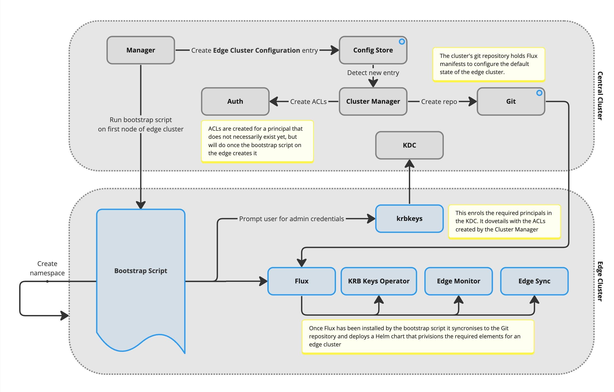
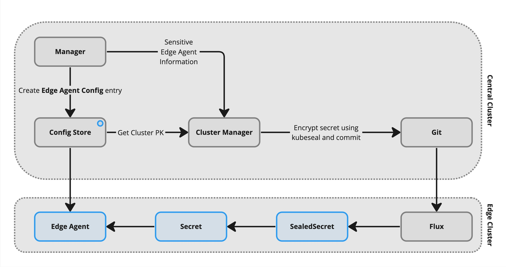

# AMRC Connectivity Stack

The AMRC Connectivity Stack (ACS) is a Kubernetes Helm chart that contains a comprehensive set of open-source services developed by the AMRC that enables an end-to-end implementation of the [Factory+](https://factoryplus.app.amrc.co.uk) framework.

## Prerequisites
Ensure that you have `kubectl` access to an existing Kubernetes cluster and familiarise yourself with the concepts of both Kubernetes and [Factory+](https://factoryplus.app.amrc.co.uk) before continuing. This chart installs a full end-to-end deployment of Factory+ onto a central cluster and there are a lot of moving parts.

## Get Started
This chart can be installed onto a local Kubernetes cluster for development or testing by following the instructions below. For production deployments, please refer to the [production deployment guide](#production-deployment).

### Install Helm
Helm is a package manager for Kubernetes that allows you to easily install and manage applications on Kubernetes. It must be installed on the machine that you'll be using to deploy ACS _from_. To install Helm, follow the instructions [here](https://helm.sh/docs/intro/install/).

### Install Kubectl
Kubectl is a command-line tool for controlling Kubernetes clusters. It must be installed on the machine that you'll be using to deploy ACS _from_. To install Kubectl, follow the instructions [here](https://kubernetes.io/docs/tasks/tools/install-kubectl/).

### Verify Installation
To verify that Helm and Kubectl have been installed correctly, run the following commands:
```bash
helm version
kubectl version
```

### Configure DNS

This Chart creates a load balancer on your Kubernetes cluster that exposes all services at various subdomains. Please ensure that you have a wildcard DNS entry configured to direct all `*.<baseURL>` requests to your Kubernetes cluster.

### Configure TLS

#### Production Deployment
If `acs.secure` is set to `true` in your deployment (enabled by default) then you must also create a wildcard TLS secret on the cluster in the`default` namespace with the same name as the value specified in `acs.tlsSecretName` _before_ installing ACS. The TLS certificate must be valid for all domains covered by the wildcard DNS entry.

#### Development (Insecure) Deployment
If you have disabled `acs.secure` then you can skip this step but ensure that you update the `traefik.ports.web.expose` and `traefik.ports.mqtt.expose` values to `true` in your `values.yaml` file. You may also optionally want to disable the `traefik.ports.websecure.enabled` and `traefik.ports.mqttsecure.enabled` values.

### Install ACS

Now it's time to install the AMRC Connectivity Stack. It's recommended that you utilise a tool like Lens to view the cluster status as it bootstraps to ensure that everything is working as expected. Lens can be downloaded [here](https://k8slens.dev/).

First, add the AMRC Factory+ Helm repository:
```bash
helm repo add amrc-connectivity-stack https://amrc-factoryplus.github.io/amrc-connectivity-stack/build
helm repo update
```

Next, create a `values.yaml` file in a sensible location on your local machine. This file will be used to configure the deployment and can contain many options for customisation and configuration (see [values](#values) for more information). At the very least you should set the following values but remember to change them to your specific deployment:
```yaml
acs:
  baseUrl: factoryplus.myorganisation.com # Set this to the domain that ACS will be served from. This should be the same as the wildcard DNS entry you created earlier.
  organisation: MYORGANISATION # Set this to the name of your organisation. It will be used across the deployment for branding and naming.
  secure: false # Set this to true if you want to serve ACS over HTTPS. This is recommended for production deployments but can be turned off for development.
identity:
  realm: FACTORYPLUS.MYORGANISATION.COM # Set the identity realm for the deployment. This is used to namespace the identity server and should be unique to your deployment. It is recommended that you use the baseUrl in capitals for this value.
```

Before we install, we need to create the `factory-plus` namespace, which is where all ACS services will be deployed to. If a different namespace is chosen by changing the `-n <namespace>` on the helm install command then ensure the namespace exists before installing ACS.

To create the `factory-plus` namespace, run the following command:
```bash
kubectl create namespace factory-plus
```

Finally, install ACS by running the following command.
```bash
helm install acs amrc-connectivity-stack/amrc-connectivity-stack --version ^3.0.0 -f values.yaml --namespace factory-plus
```

If all went to plan you should now have a fully functioning ACS deployment beginning to deploy to your local Kubernetes cluster. Note that it can take a few minutes to have all services operational.

Take note of the service URLs printed at the end of the installation. You will need these to connect to the various services.

### Verifying Installation

Get the password for the admin user by running the following command. Note that it may not return the password until the deployment has finished bootstrapping.

```bash
echo $(sudo kubectl get secret krb5-passwords -o jsonpath="{.data.admin}" -n {{.Release.Namespace}} | base64 --decode)
```

Once you have the admin password you can connect to the MQTT broker at the URL supplied to you and subscribe to spBv1.0/#. It's advisable to do this before you start adding devices to the system so that you can see all traffic. MQTTExplorer is a good tool for this and can be downloaded [here](https://mqtt-explorer.com/), however building the tool from [this](https://github.com/thomasnordquist/MQTT-Explorer/pull/712) pull request may be more useful when working with ACS and Sparkplug messages.

Next, log into the manager at the URL supplied to you as the `admin` user and create a `Group`, `Node` (Soft Gateway) and `Device`. Configure the device by completing the `Information`, `Connection`, and `Schema` tabs until you see a green `VALID` tag in the top right corner. Once you've configured the device you should see MQTT traffic begin to flow.

Finally, get the admin password for InfluxDB by running the following command and log into the InfluxDB instance as the admin user at at the URL supplied to you.

```bash
echo $(sudo kubectl get secret acs-influxdb2-auth -o jsonpath="{.data.admin-password}" -n {{.Release.Namespace}} | base64 --decode)
```

## What's Changed in V3?

### Edge Clusters
V3.0.0 of the AMRC Connectivity Stack introduces a number of new components to enable effective management of edge clusters. Prior to this version, the chart was designed to be installed onto a single central cluster that consisted of all central nodes _and_ all edge nodes. This was not ideal for a number of reasons, including the fact that it was impossible to utilise cloud-based clusters with on-premise edge nodes, in most cases.

Through changes to the Manager in V3, is is now possible to create "Edge Clusters" directly from the Manager UI. This action will provide you with a bootstrap script to run on a fresh Kubernetes cluster at the edge. The bootstrap script handles the installation and configuration of all necessary components to connect the edge cluster to the central cluster.



Once the edge cluster is connected to the central cluster, it will appear in the Manager UI and can have workloads assigned to it. The process for assigning workloads to edge clusters relies on components deployed to the edge during the bootstrap process, which ultimately watch the Config Store for changes to their state.


### Visualiser
The Visualiser (`visualiser.<baseURL>`) is a new component included in ACS V3.0.0 that provides a visual representation of Factory+ traffic and MQTT packets. This application is accessible from the Manager UI and provides a real-time overview of the MQTT traffic flowing through the system. It can be useful for debugging and understanding the flow of data through the system but also serves as a great communication tool for demonstrating the capabilities of Factory+.

### Sensitive Information Management
V3.0.0 leverages the power of kubernetes secrets to store sensitive configuration information such as passwords and keys for connecting to equipment. Whereas before sensitive information was stored in the device configuration files for your devices, it is now stored in kubernetes secrets and accessed by the devices at runtime. This is a more secure way of managing sensitive information ensures that only the edge cluster destined to represent the device has access to the information.



## More detailed documentation

These pages document parts of the system in more detail.

* [Edge clusters: Overall architecture](./docs/edge-clusters.md)
* [Edge clusters: Deploying to the edge](./docs/edge-deployments.md)
* [Edge clusters: Bootstrap process](./docs/edge-bootstrap.md)
* [Internal Git server](./docs/git-server.md)

## Maintainers

| Name           | Email                       |
|----------------|-----------------------------|
| Alex Godbehere | <alex.godbehere@amrc.co.uk> |
| Ben Morrow     | <b.morrow@amrc.co.uk>       |

## Values
See the `values.yaml` file for possible values. We do not list all values here as they are subject to change and the `values.yaml` file is the source of truth.
