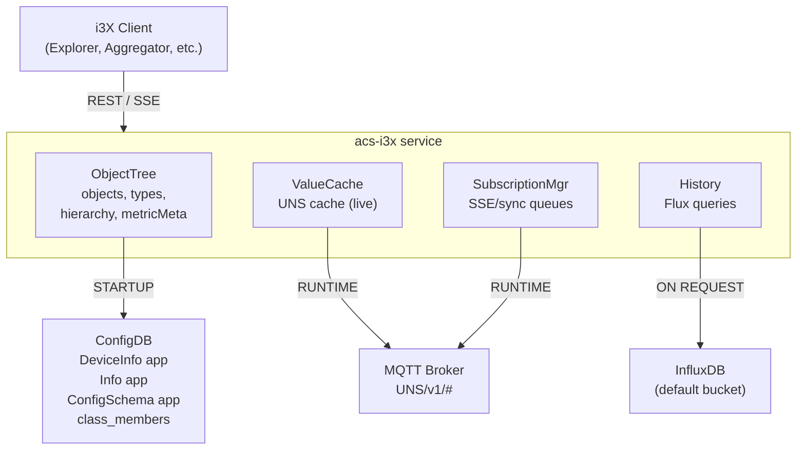
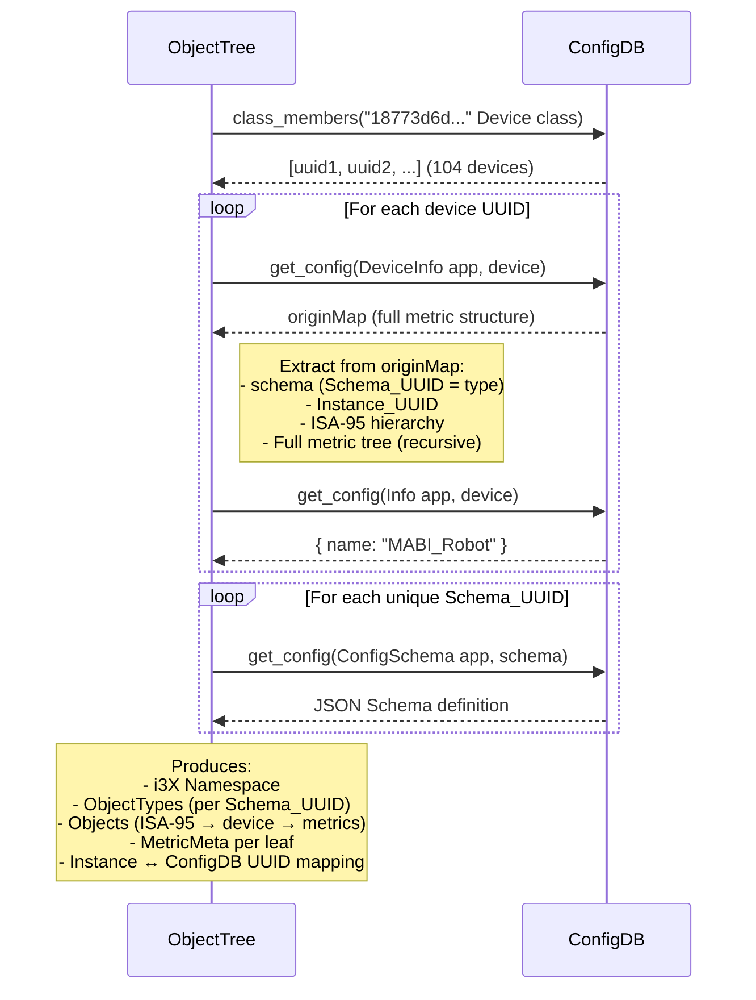
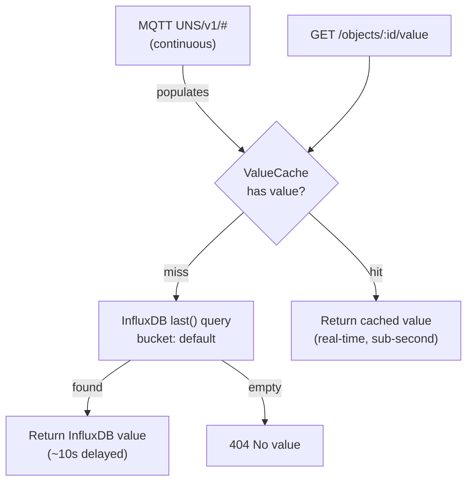
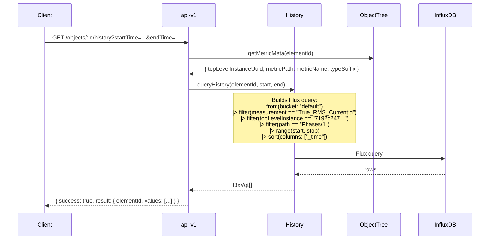
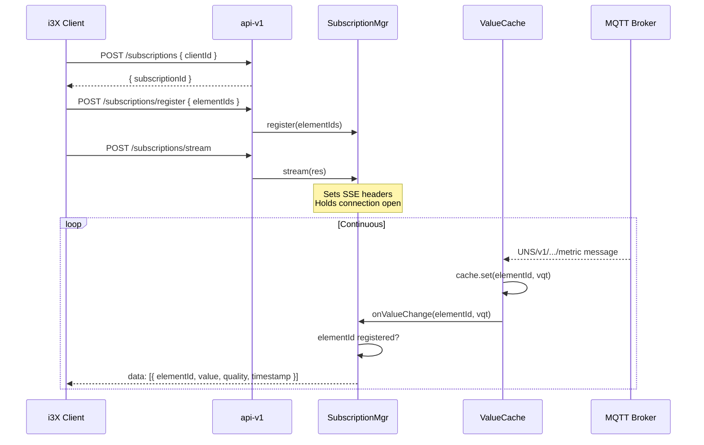

# acs-i3x Architecture

## Service Overview



## Startup: ObjectTree builds from ConfigDB

The entire object hierarchy is built at startup from ConfigDB. **The Directory is not used.**



### What the DeviceInformation app config contains

This is the same `originMap` the edge agent uses to build Sparkplug birth certificates:

```
originMap:
  Schema_UUID: "481dbce2..."          ← device schema (becomes typeElementId)
  Instance_UUID: "7192c247..."        ← device identity (for InfluxDB queries)
  Device_Information:
    Schema_UUID: "2dd093e9..."
    ISA95_Hierarchy:
      Schema_UUID: "84ac3397..."      ← found by recursive search
      Enterprise: { Value: "AMRC" }
      Site: { Value: "F2050" }
      Area: { Value: "Boardroom" }
  Phases:
    1:
      Schema_UUID: "d16b825d..."
      Instance_UUID: "1231982e..."
      True_RMS_Current:
        Sparkplug_Type: "FloatLE"     ← leaf metric
        Eng_Unit: "A"
```

The tree builder walks this recursively:
- Keys with child containers become **composition objects**
- Keys with `Sparkplug_Type` and no children become **leaf objects**
- `Instance_UUID` used where available, v5 UUID synthesised otherwise
- `MetricMeta` stored per leaf for InfluxDB queries

## Runtime: Current Values (hybrid)



| Source | Freshness | Coverage |
|---|---|---|
| ValueCache (UNS MQTT) | Real-time (sub-second) | Only devices publishing to UNS (requires ISA-95 config) |
| InfluxDB last() | ~10s delayed (historian flush interval) | All devices with any historical data |

## On Request: History



### How MetricMeta maps to InfluxDB tags

| MetricMeta field | InfluxDB concept | Example |
|---|---|---|
| `topLevelInstanceUuid` | `topLevelInstance` tag | `7192c247-573c-4e9d-89fe-618acdc99c2b` |
| `metricPath` | `path` tag | `Phases/1` |
| `metricName` + `typeSuffix` | `_measurement` | `True_RMS_Current:d` |

The type suffix is derived from `Sparkplug_Type` in the originMap:

| Sparkplug_Type | Suffix | InfluxDB field type |
|---|---|---|
| Float, Double, FloatLE, DoubleBE, etc. | `:d` | float |
| Int8, Int16, Int32, Int64 | `:i` | integer |
| UInt8, UInt16, UInt32, UInt64 | `:u` | unsigned integer |
| Boolean | `:b` | boolean |
| String (default) | `:s` | string |

## Runtime: SSE Streaming



Only works for devices publishing to UNS. Devices not on UNS never trigger SSE events (tracked in TID L3).

## Data Source Summary

| Data | Source | When | Latency |
|---|---|---|---|
| Object hierarchy (types, tree, ISA-95) | ConfigDB DeviceInformation app | Startup | Once |
| Object names | ConfigDB Info app | Startup | Once |
| JSON Schemas | ConfigDB ConfigSchema app | Startup | Once |
| Current value (primary) | MQTT UNS/v1/# via in-memory cache | Continuous | Real-time |
| Current value (fallback) | InfluxDB default bucket, last() | On request | ~10s |
| Historical values | InfluxDB default bucket, range query | On request | N/A |
| SSE streaming | MQTT UNS/v1/# via SSE bridge | Continuous | Real-time |
| Device online/offline | Not currently used | -- | -- |
