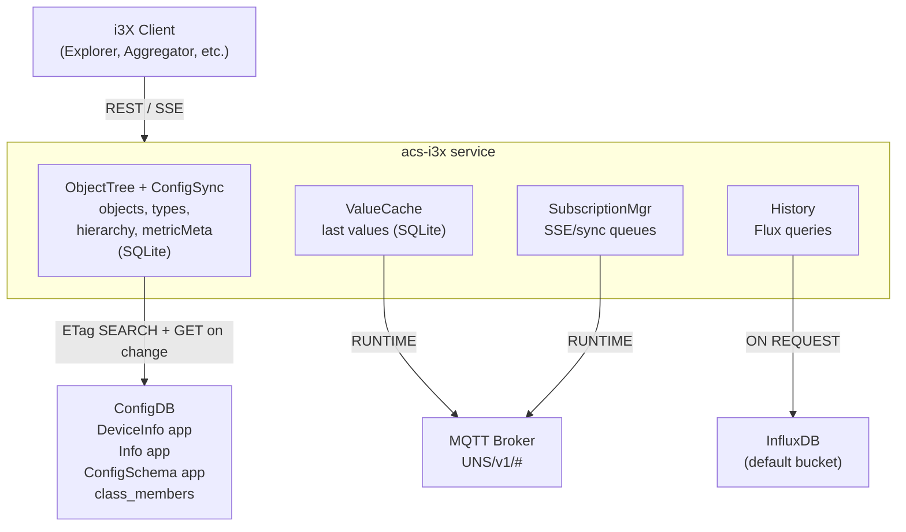
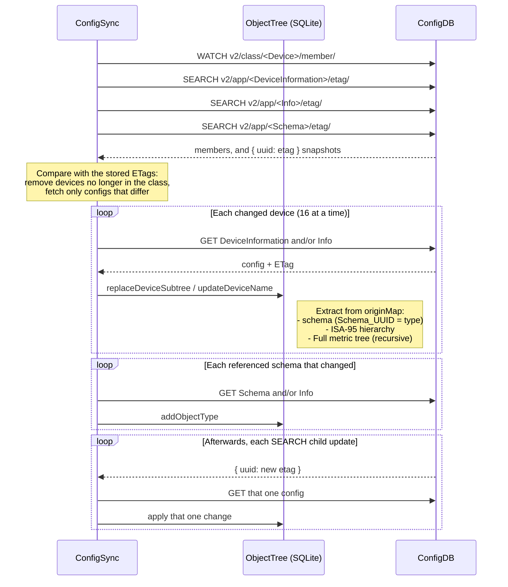
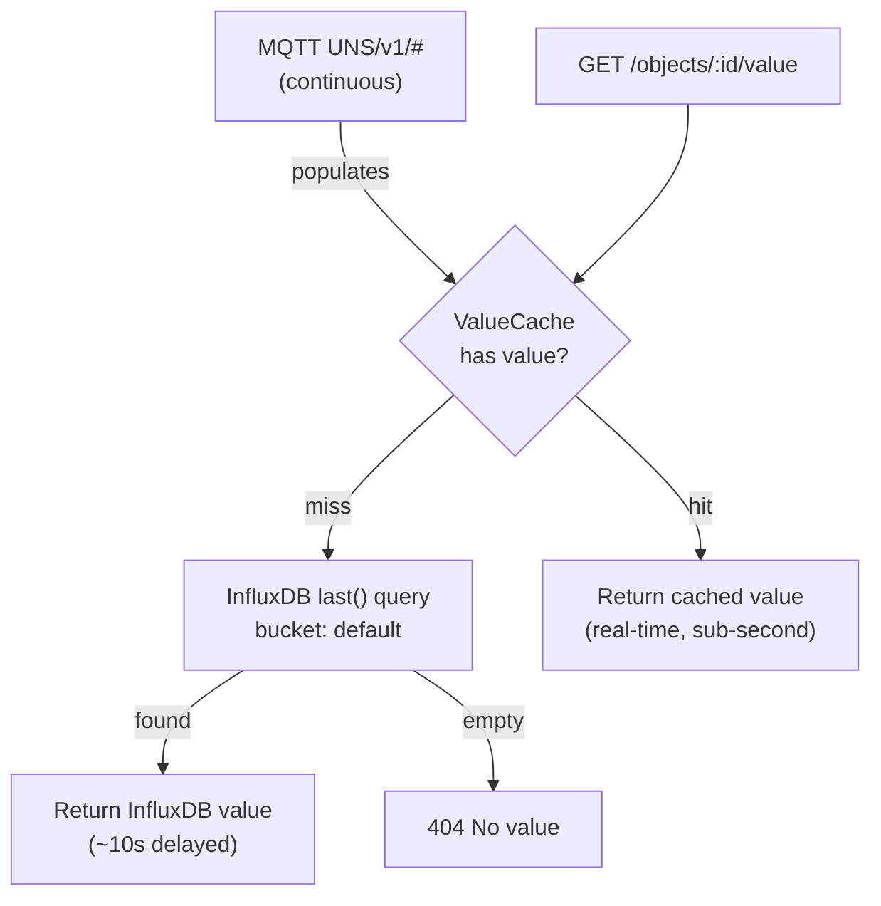
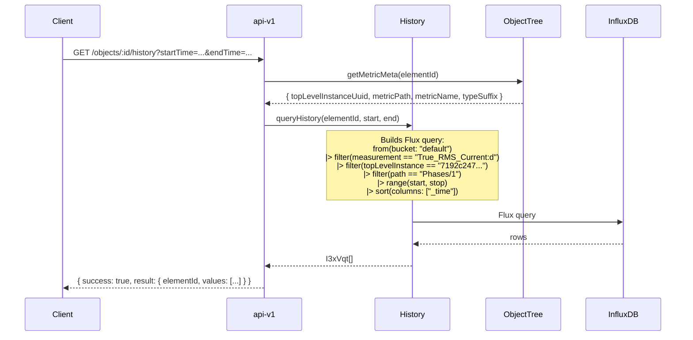
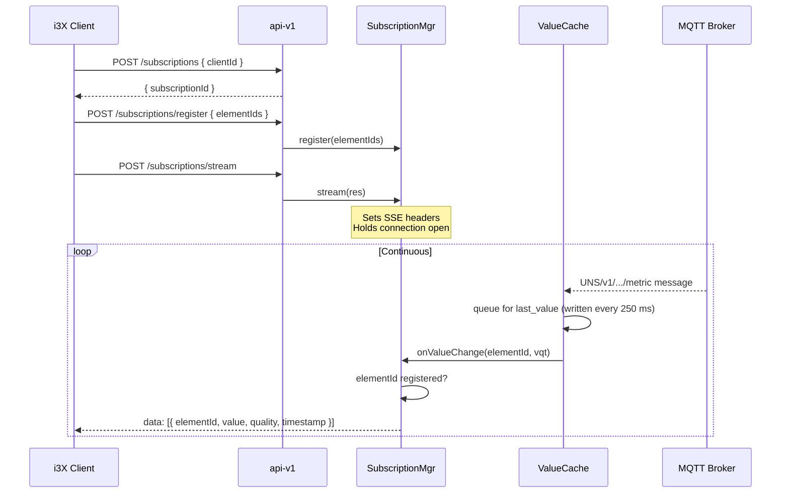

# acs-i3x Architecture

## Service Overview


```mermaid
graph TB
    Client["i3X Client<br/>(Explorer, Aggregator, etc.)"]
    
    subgraph acs-i3x["acs-i3x service"]
        OT["ObjectTree + ConfigSync<br/>objects, types,<br/>hierarchy, metricMeta<br/>(SQLite)"]
        VC["ValueCache<br/>last values (SQLite)"]
        HI["History<br/>Flux queries"]
        SM["SubscriptionMgr<br/>SSE/sync queues"]
    end
    
    ConfigDB["ConfigDB<br/>DeviceInfo app<br/>Info app<br/>ConfigSchema app<br/>class_members"]
    MQTT["MQTT Broker<br/>UNS/v1/#"]
    InfluxDB["InfluxDB<br/>(default bucket)"]
    
    Client -->|"REST / SSE"| acs-i3x
    OT -->|"ETag SEARCH + GET on change"| ConfigDB
    VC -->|"RUNTIME"| MQTT
    HI -->|"ON REQUEST"| InfluxDB
    SM -->|"RUNTIME"| MQTT
```

## Startup: ConfigSync fills the ObjectTree from ConfigDB

The object hierarchy comes from ConfigDB. **The Directory is not used.** The
tree is kept in SQLite (`/data/i3x.db`), with the ConfigDB ETags each device
and schema was built from, so a restart serves the stored tree at once and
fetches only what changed.


```mermaid
sequenceDiagram
    participant CS as ConfigSync
    participant OT as ObjectTree (SQLite)
    participant CDB as ConfigDB

    CS->>CDB: WATCH v2/class/<Device>/member/
    CS->>CDB: SEARCH v2/app/<DeviceInformation>/etag/
    CS->>CDB: SEARCH v2/app/<Info>/etag/
    CS->>CDB: SEARCH v2/app/<Schema>/etag/
    CDB-->>CS: members, and { uuid: etag } snapshots

    Note over CS: Compare with the stored ETags:<br/>remove devices no longer in the class,<br/>fetch only configs that differ

    loop Each changed device (16 at a time)
        CS->>CDB: GET DeviceInformation and/or Info
        CDB-->>CS: config + ETag
        CS->>OT: replaceDeviceSubtree / updateDeviceName
        Note right of OT: Extract from originMap:<br/>- schema (Schema_UUID = type)<br/>- ISA-95 hierarchy<br/>- Full metric tree (recursive)
    end

    loop Each referenced schema that changed
        CS->>CDB: GET Schema and/or Info
        CS->>OT: addObjectType
    end

    loop Afterwards, each SEARCH child update
        CDB-->>CS: { uuid: new etag }
        CS->>CDB: GET that one config
        CS->>OT: apply that one change
    end
```

### What the DeviceInformation app config contains

This is the same `originMap` the edge agent uses to build Sparkplug birth certificates:

```
originMap:
  Schema_UUID: "481dbce2..."          ← device schema (becomes typeElementId)
  Instance_UUID: "7192c247..."        ← device identity (for InfluxDB queries)
  Device_Information:
    Schema_UUID: "2dd093e9..."
    ISA95_Hierarchy:
      Schema_UUID: "84ac3397..."      ← found by recursive search
      Enterprise: { Value: "AMRC" }
      Site: { Value: "F2050" }
      Area: { Value: "Boardroom" }
  Phases:
    1:
      Schema_UUID: "d16b825d..."
      Instance_UUID: "1231982e..."
      True_RMS_Current:
        Sparkplug_Type: "FloatLE"     ← leaf metric
        Eng_Unit: "A"
```

The tree builder walks this recursively:
- Keys with child containers become **composition objects**
- Keys with `Sparkplug_Type` and no children become **leaf objects**
- `Instance_UUID` used where available, v5 UUID synthesised otherwise
- `MetricMeta` stored per leaf for InfluxDB queries

## Runtime: Current Values (hybrid)


```mermaid
flowchart TD
    REQ["GET /objects/:id/value"]
    CACHE{"ValueCache<br/>has value?"}
    INFLUX["InfluxDB last() query<br/>bucket: default"]
    MQTT["MQTT UNS/v1/#<br/>(continuous)"]
    RESP_CACHE["Return cached value<br/>(real-time, sub-second)"]
    RESP_INFLUX["Return InfluxDB value<br/>(~10s delayed)"]
    RESP_404["404 No value"]

    MQTT -->|"populates"| CACHE
    REQ --> CACHE
    CACHE -->|"hit"| RESP_CACHE
    CACHE -->|"miss"| INFLUX
    INFLUX -->|"found"| RESP_INFLUX
    INFLUX -->|"empty"| RESP_404
```

| Source | Freshness | Coverage |
|---|---|---|
| ValueCache (UNS MQTT) | Real-time (sub-second) | Only devices publishing to UNS (requires ISA-95 config) |
| InfluxDB last() | ~10s delayed (historian flush interval) | All devices with any historical data |

`POST /objects/value` checks the ValueCache for every id first. It then
reads all the misses from InfluxDB in one batch (`History.getValues`).
The batch reads every leaf it needs, including every descendant leaf
of a composition, with one Flux query per 100 devices
(`topLevelInstance`), and runs at most 4 of those queries at once:

```
from(bucket: "default")
  |> range(start: -30d)
  |> filter(fn: (r) => r["_measurement"] == "<measurement 1>" or ...)
  |> filter(fn: (r) => r["topLevelInstance"] == "<device 1>" or ...)
  |> filter(fn: (r) => r["_field"] == "value")
  |> last()
```

The `_measurement` filter lists the measurements the chunk's leaves
need. It is left out when a chunk needs more than 50, and the query
then reads every series of its devices. The InfluxDB client timeout
is 10 s.

Each leaf takes the first returned row whose measurement, device and
path match. When a leaf has more than one series (for example after a
device rename changes the `device` tag), that is the same row the
single-leaf query returns. `GET /objects/:id/value` on a composition
uses the same batch read for its leaves.

## On Request: History


```mermaid
sequenceDiagram
    participant Client
    participant API as api-v1
    participant HI as History
    participant OT as ObjectTree
    participant IDB as InfluxDB

    Client->>API: GET /objects/:id/history?startTime=...&endTime=...
    API->>OT: getMetricMeta(elementId)
    OT-->>API: { topLevelInstanceUuid, metricPath, metricName, typeSuffix }
    API->>HI: queryHistory(elementId, start, end)
    
    Note over HI: Builds Flux query:<br/>from(bucket: "default")<br/>  |> filter(measurement == "True_RMS_Current:d")<br/>  |> filter(topLevelInstance == "7192c247...")<br/>  |> filter(path == "Phases/1")<br/>  |> range(start, stop)<br/>  |> sort(columns: ["_time"])
    
    HI->>IDB: Flux query
    IDB-->>HI: rows
    HI-->>API: I3xVqt[]
    API-->>Client: { success: true, result: { elementId, values: [...] } }
```

### How MetricMeta maps to InfluxDB tags

| MetricMeta field | InfluxDB concept | Example |
|---|---|---|
| `topLevelInstanceUuid` | `topLevelInstance` tag | `7192c247-573c-4e9d-89fe-618acdc99c2b` |
| `metricPath` | `path` tag | `Phases/1` |
| `metricName` + `typeSuffix` | `_measurement` | `True_RMS_Current:d` |

The type suffix is derived from `Sparkplug_Type` in the originMap:

| Sparkplug_Type | Suffix | InfluxDB field type |
|---|---|---|
| Float, Double, FloatLE, DoubleBE, etc. | `:d` | float |
| Int8, Int16, Int32, Int64 | `:i` | integer |
| UInt8, UInt16, UInt32, UInt64 | `:u` | unsigned integer |
| Boolean | `:b` | boolean |
| String (default) | `:s` | string |

## Runtime: SSE Streaming


```mermaid
sequenceDiagram
    participant Client as i3X Client
    participant API as api-v1
    participant SM as SubscriptionMgr
    participant VC as ValueCache
    participant MQTT as MQTT Broker

    Client->>API: POST /subscriptions { clientId }
    API-->>Client: { subscriptionId }
    
    Client->>API: POST /subscriptions/register { elementIds }
    API->>SM: register(elementIds)
    
    Client->>API: POST /subscriptions/stream
    API->>SM: stream(res)
    Note over SM: Sets SSE headers<br/>Holds connection open
    
    loop Continuous
        MQTT-->>VC: UNS/v1/.../metric message
        VC->>VC: queue for last_value (written every 250 ms)
        VC->>SM: onValueChange(elementId, vqt)
        SM->>SM: elementId registered?
        SM-->>Client: data: [{ elementId, value, quality, timestamp }]
    end
```

Only works for devices publishing to UNS. Devices not on UNS never trigger SSE events (tracked in TID L3).

## Data Source Summary

| Data | Source | When | Latency |
|---|---|---|---|
| Object hierarchy (types, tree, ISA-95) | ConfigDB DeviceInformation app | Start, then each change | ETag SEARCH |
| Object names | ConfigDB Info app | Start, then each change | ETag SEARCH |
| JSON Schemas | ConfigDB ConfigSchema app | Start, then each change | ETag SEARCH |
| Current value (primary) | MQTT UNS/v1/# into SQLite `last_value` | Continuous | Real-time |
| Current value (fallback) | InfluxDB default bucket, last(); kept in `last_value` for devices that publish to UNS | First read of a leaf (every read for other devices), and any read during a catch-up | ~10s |
| Current value (catch-up) | InfluxDB default bucket, last() since the values were last current | After a restart or MQTT reconnect, and every refresh interval for values kept from InfluxDB | Margin (60 s) plus the query |
| Historical values | InfluxDB default bucket, range query | On request | N/A |
| SSE streaming | MQTT UNS/v1/# via SSE bridge | Continuous | Real-time |
| Device online/offline | Not currently used | -- | -- |
