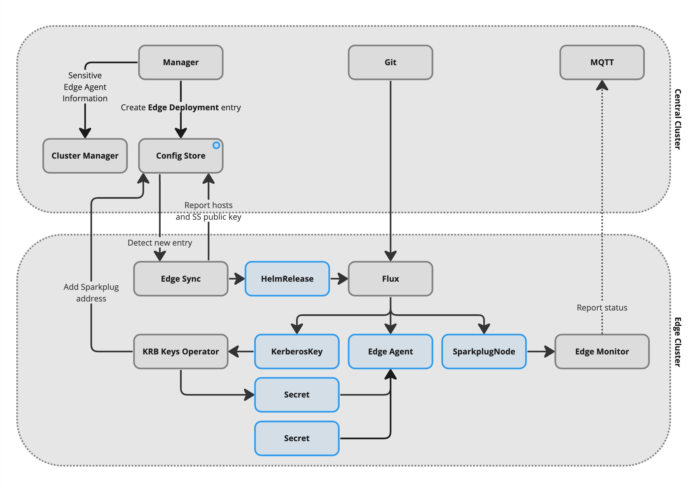
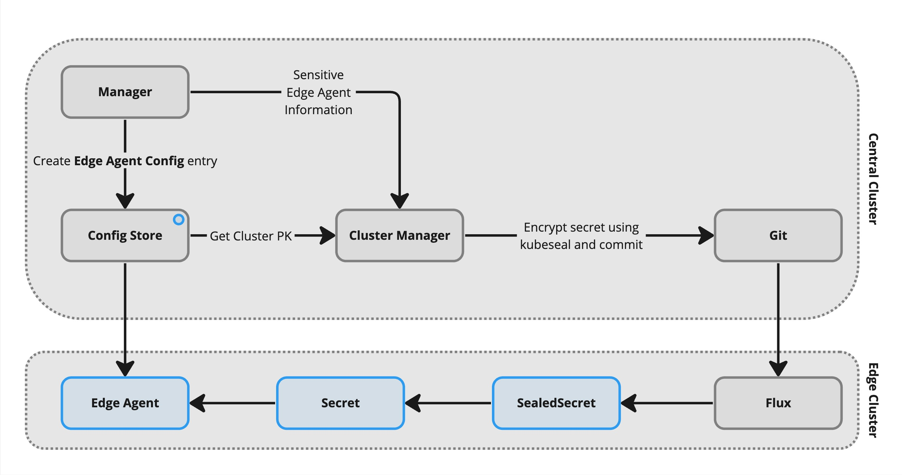

# Edge Clusters: Deploying to the Edge

This document assumes familiarity with the [overall edge cluster
architecture](overview.md), including the data structures used by
the ConfigDB.



## Edge Helm Charts

When an Edge Agent is deployed in the Manager, you need to specify what
you would like to deploy. This will normally be an ACS Edge Agent, but
can also include other services to be deployed to the edge alongside the
Edge Agent. For example, we have developed a simple service which reads
Modbus/TCP and supplies a REST interface the Edge Agent can consume;
this removes the need to keep pushing more drivers into the Edge Agent
codebase itself.

Services that can be deployed to the edge must be packaged in the form
of a [Helm](https://helm.sh) chart. These Helm charts live in Git repositories
on the central cluster, from where the Flux installations on the edge clusters
can pull them. A default installation of ACS will pull the on-prem Helm charts
repo from the `edge-helm-charts` repo on the AMRC-FactoryPlus Github, but this
can be changed in the ACS `values.yaml`.

Helm charts can be deployed from multiple Git repositories by specifying the
`source` field in the Edge deployment entry. This allows you to maintain your
own chart repositories separately from the core ACS charts.

In order to allow for deploying the same chart in different
configurations, the ConfigDB contains a set of 'Helm chart template'
entries which are the items which can actually be deployed. These
reference a particular chart in the charts repo and give a template for
the `values.yaml` to use on deployment. This template will be filled in
with a few fixed pieces of information about the deployment such as the
UUID and the hostname of the machine to deploy to.

## Edge Deployment

Creating a Deployment in the Manager simply creates an entry in the
ConfigDB detailing what is to be deployed and where. These entries live
under the 'Edge deployment' Application and use the UUID of the Edge
Agent as their Object. The entry specifies the Helm charts to deploy,
the cluster to deploy to, and a name for the deployment; if this is an
Edge Agent then the name will become the Sparkplug Node-ID. The entry
can also specify a `source` field that references a Git repository UUID,
which allows deploying charts from different repositories.

The deployment entry also specifies which host on the cluster to deploy
to, for deployments that target a specific host. It is possible to omit
the hostname by selecting a 'Floating' deployment in the Manager; this
will deploy such that the container might end up running anywhere in the
cluster, subject to 'specialised host' taints applied in Kubernetes.

These deployment entries are picked up by the Edge Sync operator on the
edge cluster. This operator picks out the entries applicable to its own
cluster and uses the 'Helm chart template' entries to construct a set of
Flux HelmRelease Kubernetes objects. Flux on the edge then pulls the
Helm charts from the internal Git repo and performs the deployment.

## Edge Agent Configuration

When the Edge Agent configuration is updated in the Manager, this
information also goes into the ConfigDB. The Edge Agent pulls its
configuration from the ConfigDB at startup, and the Edge Monitor tracks
the current state of the ConfigDB and instructs the Edge Agent to reload
its config if it is out of date.



Secret information (credentials for communicating with devices) is
handled differently from the rest of the configuration. The
corresponding fields in the Manager are write-only; once a password has
been entered in the field it cannot be read or copied. An entered
password is immediately passed over to the Cluster Manager, which
provides a secret sealing service that encrypts the secret using a
public key whose private key is only present on the edge cluster. The
result is wrapped up in a Kubernetes SealedSecret manifest and committed
to the cluster git repository, from where it will be unpacked by Flux on
the edge cluster and decrypted into an ordinary Kubernetes Secret by the
sealed secrets service running on the edge cluster. The contents of this
Secret are then referenced by the Edge Agent configuration in place of
the secret information.

The Edge Monitor also tries to make sure that an Edge Agent which should
be running is actually running. If it has seen no data packets from the
Edge Agent for a certain length of time (by default 3 minutes) it will
send a rebirth request. If three rebirth requests are sent with no
packet received then the Edge Monitor will raise an Alert over
Sparkplug.

## Implementation Details

This section describes some of the details of the implementation,
hopefully providing the information needed to debug any problems.

### Edge Deployment ConfigDB Application

The 'Edge deployment' Application has UUID
`f2b9417a-ef7f-421f-b387-bb8183a48cdb`. Entries of this type are created
by the Manager or directly by administrators and are picked up by the
Edge Sync operators running on the edge clusters.

Entries are JSON objects with the following properties:

* `cluster`: The UUID of the cluster this deployment targets.
* `hostname` (optional): The Kubernetes hostname of the host this
  deployment should be deployed to.
* `name`: A name for the the deployment. For Edge Agents this will
  become the Sparkplug Node-ID.
* `chart`: A UUID representing the Helm chart to deploy. This
  references an entry under the 'Helm chart template' Application.
* `source` (optional): The UUID of the Git repository containing the Helm
  charts to deploy. If not specified, the default "helm-charts" repository
  is used.

> Note: When creating Git repository configuration entries for 
> custom edge helm charts, make sure to use the `Shared repo` class 
> as it has the correct permissions for the edge components to 
> access it.

The Edge Sync operators will pick up changes to these entries via the
ConfigDB MQTT interface. If an update appears to have been missed then
restarting the Edge Sync operator will force a full reconcile.

### Helm Chart Template ConfigDB Application

The 'Helm chart template' Application has UUID
`729fe070-5e67-4bc7-94b5-afd75cb42b03`. Entries of this type are created
by the `acs-service-setup` or by an administrator and are used by the
Edge Sync and Cluster Manager operators to deploy Helm charts to the
edge. These entries are the options provided by the Manager when
creating a cluster or an Edge Agent.

Entries are JSON objects with the following properties:

* `chart`: The name of the chart to deploy. This is path from the 
  top level of the checked out repo.
* `source` (optional): The UUID of the Git repository containing the Helm
  chart. If not specified, the default "helm-charts" repository is used.
* `prefix` (optional): A kubernetes-compatible prefix to add to the 
  chart name. If not provided the chart value will be used. Must be 
  specified if the chart name has slashes in it otherwise the name 
  generated will not be kubernetes-compatible.
* `values`: An object equivalent to a Helm `values.yaml` file.

The `values` object will be scanned recursively for strings of the form
`"{{template}}"`. These will be replaced with values from the cluster or
deployment entry referencing the templates. Templates available are
`{{uuid}}` for the UUID of the object the entry applies to, and
`{{name}}` and `{{hostname}}` from the content of the entry. Hostname is
only available for deployments, and may be empty for a floating
deployment.

### HelmRelease Template ConfigDB Application

The 'HelmRelease template' Application has UUID
`88436128-09a3-4c9c-b7f4-b0e495137265`, and should have only a single
entry with the same UUID. This entry is created by `acs-service-setup`
and should not be modified. It is used by the Edge Sync operator and by
the Cluster Manager when a Flux HelmRelease resource needs to be
created.

### Edge Agent Config ConfigDB Application

The 'Edge Agent config' Application has UUID
`aac6f843-cfee-4683-b121-6943bfdf9173`. Entries of this type are
normally written by the Manager and are read by the Edge Agent. The
ETags on these entries are published by the Edge Agent over Sparkplug
and used by the Edge Monitor to check which revision of the config the
Edge Agent is using at the moment.

The internal structure of these entries is currently not documented and
should be considered a private implementation matter between the Manager
and the Edge Agent. The format is compatible with that used by the ACS
v2 Edge Agent and retried directly from the Manager, with the exception
of the `sparkplug` section which is now mostly ignored.

The Edge Monitor operator on an edge cluster watches for changes to
these entries (via the ConfigDB MQTT interface) and sends the Edge Agent
the Sparkplug NCMD `Node Control/Reload Edge Agent Config` if the Edge
Agent is publishing a different config revision from the current ETag
from the ConfigDB. This causes the Edge Agent to reload its config.

### KerberosKey Kubernetes Resource

This is a Kubernetes Custom Resource with ApiVersion
`factoryplus.app.amrc.co.uk/v1` and Kind `KerberosKey`. Resources of
this type are used both centrally and at the edge to instruct the
Kerberos Keys operator to create an account in the KDC and to associate
it with an account in the Factory+ services.

The `krbkeys` operators running on the edge are only given permission to
create or modify Kerberos principals whose second component is the name
of the cluster. (Components of a Kerberos principal name are sections of
the username part, before the `@`, separated by `/`.) This restricts the
extent of the damage in the event of a security compromise of an edge
cluster.

KerberosKeys objects at the edge are deployed by the Helm charts. The
'Edge cluster' chart deploys four: `krbkeys` itself, Flux, the Edge Sync
operator, and the Edge Monitor. The Edge Agent chart deploys an
additional KerberosKey for each Edge Agent.

KerberosKeys which create an account in the Factory+ services have an
`account` section. This may have the following properties:

* `uuid` (not with `class`): This is the UUID to use for the account.
  The object for the account must already exist in the ConfigDB.
* `class` (not with `uuid`): This is the UUID of the class to use to
  create a new account.
* `name` (only with `class`): The General Information name of the
  generated account object.
* `groups`: An array of group UUIDs to add the account to in the Auth
  service.
* `aces`: An array of objects with `permission` and `target` properties
  indicating explicit ACEs to grant to the account.
* `sparkplug`: Requests creation of a `Sparkplug address information`
  ConfigDB entry. This will be used by the MQTT server to grant topic
  access and by the clients to choose the topics to publish on.
  Properties:
    * `node`: The Sparkplug Node-ID.
    * `group` (optional): The Sparkplug Group-ID. This is optional for
      a KerberosKey on an edge cluster, where it will default to the
      Sparkplug Group associated with the Cluster UUID.

The operator will attach a
`krbkeys.factoryplus.app.amrc.co.uk/account-uuid` annotation to the
KerberosKey resource once it has decided what the account UUID should
be.

### SparkplugNode Kubernetes Resource

This is a Kubernetes Custom Resource with ApiVersion
`factoryplus.app.amrc.co.uk/v1` and Kind `SparkplugNode`. Resources of
this type are deployed to the edge to let the Edge Monitor know what it
should be monitoring.

Resources of this type are deployed by the Edge Agent Helm chart. They
have the following properties:

* `uuid`: The UUID of the Sparkplug Node to monitor. The Sparkplug
  Address of the Node will be looked up in the ConfigDB under the
  `Sparkplug address information` application.
* `edgeAgent`: A boolean which is `true` if this is an ACS Edge Agent,
  `false` if this is some other Sparkplug Node implementation. Config
  file monitoring is only performed on Edge Agents.
* `interval` (default `3m`): A duration string indicating how often to
  expect this Node to publish data (data from the Node itself or from
  any Device counts).
* `secrets` (optional): An array of names of SealedSecrets to monitor
  for changes. This only applies to Edge Agents. Changes to the
  SealedSecrets will cause a config reload NCMD to be sent.

The Edge Monitor will create a child Device for each SparkplugNode
resource, named after the UUID of the Node it is monitoring. This Device
will publish an Alert if the Monitor cannot get a response from the Node
after repeated attempts. The Device will publish `DDEATH` if the
SparkplugNode resource is removed.

## Multiple Chart Sources

ACS supports deploying Helm charts from multiple Git repositories. This allows
you to maintain your own chart repositories separately from the core ACS charts.

### How It Works

1. Create a Git repository configuration entry in the ConfigDB:
   ```json
   {
     "path": "shared/my-charts",
     "pull": {
       "main": {
         "url": "https://github.com/myorg/my-charts.git",
         "ref": "main",
         "auth": {
            "secretRef": "github_credentials"
         },
         "interval": "5m"
       }
     }
   }
   ```
   
Note: the `secretRef` key references the **key** in the Kubernetes 
secret, not the secret name itself. The secret name is defined in 
the values file as `git.credentialsSecrets`.

2. When creating a Helm Chart Template, specify the `source` field with the UUID
   of your Git repository and optionally the `prefix` field for subdirectories:
   ```json
    {
      "chart": "charts/my-chart",
      "prefix": "my-chart",
      "source": "<UUID of Git Repo>",
      "values": {
        "hostname": "{{hostname}}",
        "name": "{{name}}",
        "uuid": "{{uuid}}"
      }
    }
   ```

3. The Edge Sync operator will:
   - Extract the `source` and `prefix` fields from the Helm Chart Template
   - Look up the repository URL for the source UUID
   - Create a GitRepository resource on the edge cluster for each unique source
   - Update HelmRelease resources to reference the correct source and path

4. Flux on the edge cluster will pull the Helm charts from the specified Git
   repository and deploy them.

### Implementation Details

The Edge Sync operator creates GitRepository resources for each unique source
used by deployments targeting the current cluster. It then creates HelmRelease
resources that reference the correct GitRepository source.

Existing chart templates without a `source` field will continue to work with the
default "helm-charts" source.

## Next Steps

- [Edge Bootstrap](edge-bootstrap.md) - Learn about the bootstrap process for edge clusters
- [Edge Scout](./edge-scout.md) - Learn about the edge scout mode
- [Edge Management Overview](overview.md) - Return to the edge management overview
- [Architecture Overview](../overview.md) - Return to the architecture overview
