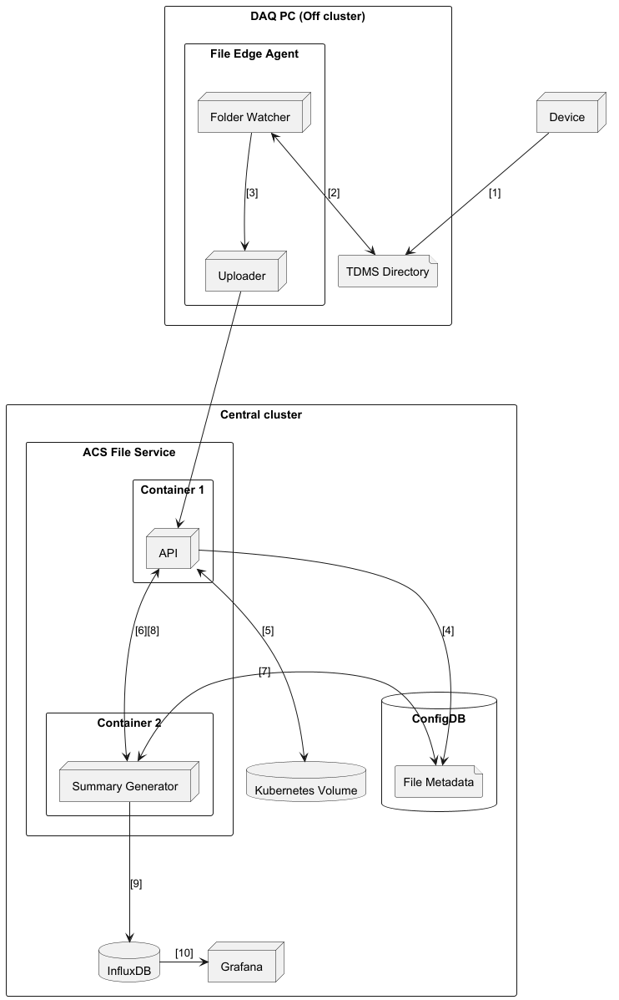

# File Service Octant

## Objective

- Define process for the automatic ingestion of large TDMS files from the local file system directory into
the ACS File Service storage.

- Investigate if ACS can extract a data summary from the TDMS files.

- The application must support the uploading of file being produced at a rate ranging from 1-10+ minutes and sizes ranging from 100MB to 14GB.
The files will contain data from the sensors written at a high frequency (1MHz).
 
## Solution 

### ACS File Service
The ACS File service deployed in ACS v4.0.0 will be modified to store file extensions in the files metadata stored in ConfigDB.
The POST file endpoint will parse a header containing the UUID of the file extension. The change/notify interface will be implemented on 
the API; on file creation it will emit the file UUID and the file type UUID. 

### File Edge Agent
The File Edge Agent will be created to automatically upload files TDMS files from the edge. It will be a NodeJS application
which watches a directory for new files, when a file is created in this directory, the file will be posted to the ACS File Service. 
This application will run off cluster and use the JS-Service-Client with username and password authentication. 

### Summary Generator
The Summary Generator is a Python application which will run in the ACS-Files pod on the central cluster. The application will
listen to the change/notify interface of the ACS File Service API, when a new file is created and the file type is TDMS, the 
application calls the File Service API with the file UUID to retrieve and parse the TDMS file to create a data summary. 
This summary is then inserted into the InfluxDB default ACS bucket. The application will use and build on the Python service 
client used by the acs-krb-keys-operator.

### Deployment Diagram 

### File Upload process

1. The TDMS file is created by the data producer and stored in a directory on the local file system.  
2. The File Edge Agent "folder watcher" detects a new file has been created and queues the file to be posted to the 
ACS file service.  
3. The queue is processed and the TDMS file is posted by the File Edge Agent "uploader" to the ACS File Service.  
4. The ACS File Service API creates the file metadata in ConfigDB.  
5. The ACS File Service API Writes the uploaded TDMS file to the Kubernetes volume.   
6. The change/notify interface on the ACS File Service sends the created file UUID and the file type UUID.  
7. On the file created notification, the File Service Summary Generator looks up the type UUID in ConfigDB to check if the file 
is a TDMS file.  
8. If the type is TDMS, a get request is made to the File Service API to retrieve the file.  
9. The summary is generated by the File Service Summary Generator and inserted into InfluxDB.  
10. The summary is visible in Grafana using the Influx datasource.   

## Future Work
The above defines an architecture for handling the storage of high frequency data files in ACS but has the following drawbacks:
- The File Edge agent is not part of the edge cluster and can't be managed by the central cluster.
- The summary won't be visible in near real-time due to the summary being generated after the file has been uploaded.
- The Summary generator will have to be modified to support the parsing of new data file types.

The proposed solution:
- Create a new edge agent type: **File Edge Agent** which will be a Sparkplug Node. 
- The summary generator will be a driver, these can be created for the parsing of different file types and will follow a 
similar architecture to the existing Edge Agent. 
- Instead of inserting the data summary into influx directly, device summary data will be published to MQTT.

