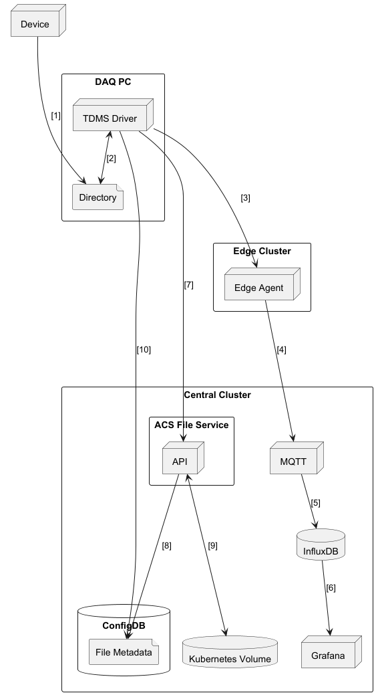

# File Service Octant

## Objective

- Define process for the automatic ingestion of large TDMS files from the local file system directory into
the ACS File Service storage.

- Investigate if ACS can extract a data summary from the TDMS files.

- The application must support the uploading of file being produced at a rate ranging from 1-10+ minutes and sizes ranging from 100MB to 14GB.
The files will contain data from the sensors written at a high frequency (1MHz).
 
## Solution

### TDMS Driver
A Driver will be created to automatically upload TDMS files from the edge to the ACS File Service and publish a summary of the TDMS file over MQTT.
It will be a NodeJS application which watches a directory for new files, when a file is created in this directory, the file will be
posted to the ACS File Service. The TDMS file summary will be generated by a Python application ran by the NodeJS Driver application,
once the summary has been generated, the Driver will publish it to the Edge Agent over MQTT. The TDMS Driver will run off cluster 
and use the JS-Service-Client with username and password authentication.

### Deployment Diagram 

### File Upload process

1. The TDMS file is created by the data producer and stored in a directory on the local file system.  
2. The TDMS Driver detects a new file has been created and runs the Python script to generate the file summary.
3. The file summary is published over MQTT to the Edge Agent. 
4. The file summary is published by the Edge Agent to the Central cluster MQTT broker.
5. The file summary is stored in the historian. 
6. The summary is visible in Grafana using the Influx datasource.
7. The TDMS file is published to the ACS File Service.
8. The ACS File Service API creates the file metadata in ConfigDB.  
9. The ACS File Service API Writes the uploaded TDMS file to the Kubernetes volume.   
10. The Driver writes the TDMS file extension UUID and the device ID to the file metadata in ConfigDB.

