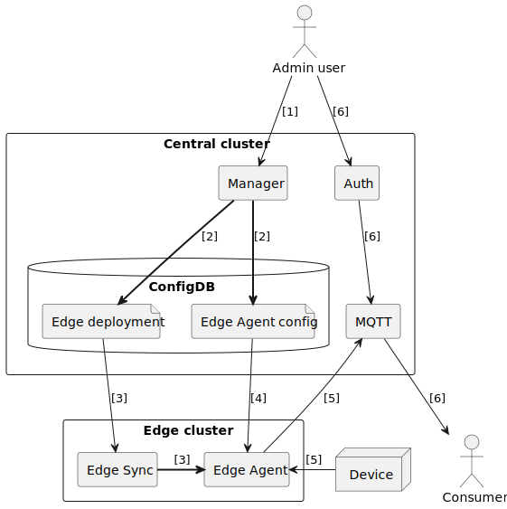
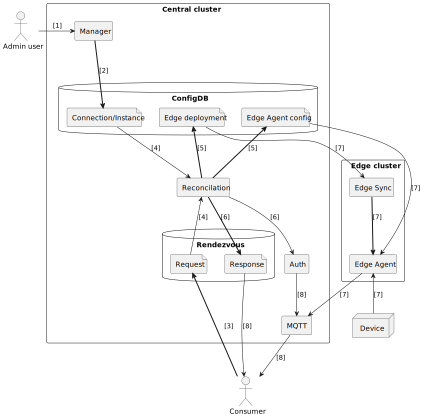

# Dynamic Deployment proposal

This proposal moves from the current situation, where Edge Agents are
deployed individually by human managers and sit collecting data
permanently, to a more dynamic situation where the human administrators
make configure the data which is available to be collected but the
actual collection does not start until a consumer requests it.

There are several advantages to this.
* The most important is that data is not collected, wasting bandwidth,
  historian storage, energy and ultimately money, unless there is a use
  for it.
* A dynamic framework of this kind is needed to successfully perform any
  sort of data discovery. With the current Directory it is possible to
  find out where data of a certain kind is being published, but not to
  request access to it.
* The framework opens the door to other interesting possibilities, from
  requesting data in an alternative format (e.g. the MQTT UNS layout) to
  requesting additional services such as automatic translation from one
  schema to another.
* The framework creates Sparkplug Devices dedicated to individual
  consumers, which only publish data intended for that consumer. This
  means the historian can be set up to provide the appropriate access to
  historical data.

## Overview

The current ACS v3 Edge Agent deployment process works like this:

1. An administrator configures an Edge Agent in the Manager. This
   includes information about where the Edge Agent should run, the
   connections it should make to systems it is collecting data from, and
   the schemas used to provide semantics to the data.

2. The Manager uses this information to build _Edge deployment_ and
   _Edge Agent config_ ConfigDB entries.

3. The Edge Sync operator running on the edge cluster picks up the _Edge
   deployment_ entry and deploys a new Edge Agent.

4. The new Edge Agent reads the _Edge Agent config_ entry which contains
   the connection and schema instance information.

5. The Edge Agent connects to its data sources, starts reading data and
   publishing it over Sparkplug, with attached semantics.

6. An administrator grants permission for a consumer to consume the data
   via MQTT.

The proposed new process adds an extra service sitting between
configuration and deployment, and works like this:

1. An administrator configures an available connection in the Manager.
   This is not yet attached to a specific Edge Agent, but information is
   provided about topology (where this connection is accessible from).
   Schema instances are also defined, specifying the data that would be
   available from that connection.

2. The Manager does not combine this information into a single Edge
   Agent config, instead it records the pieces in the ConfigDB
   individually.

3. A potential data consumer makes a request to a new service, the
   Rendezvous service, which acts as a broker between the consumer and
   one or more reconcilation services. This request specifies the data
   the consumer would like made available.

4. Another new service, the Reconcilation service, reads the consumer's
   request and the connection and instance configuration created by the
   Manager. Using this it works out which of the configured instances
   can be used to satisfy the consumers request. The appropriate metrics
   from the instances are collected up into a set of Devices dedicated
   to this consumer.

5. Having decided what data needs to be collected, the Reconcilation
   service collates this into a set of Edge Agents that need to be
   deployed. It is likely that a single Edge Agent will be collecting
   data from multiple connections and distributing it to multiple
   consumers. The Reconcilation service creates _Edge deployment_ and
   _Edge Agent config_ entries.

6. The Reconciliation service configures the Auth service to allow the
   consumer to subscribe to the new Device and publishes a response via
   the Rendezvous service to let the consumer know where to find the new
   Device.

7. The Edge Sync operator on the edge cluster deploys the Edge Agent as
   before. The Edge Agent reads its config, connects to its data
   sources, and publishes the requested data to MQTT. 

8. The Consumer reads the responses published to the Rendezvous service.
   These contain the information needed to make appropriate Sparkplug
   MQTT subscriptions and extract the data requested.

## Reconcilation service

The Reconcilation service is the major new component here. This service
accepts requests from consumers wanting data, arranges for the data to
be made available, and informs the consumers of where they can find it.
The Reconcilation service has an important authorisation role as it sits
as the gatekeeper between the data and the consumers.

The Reconciliation service specified here can accept requests to provide
access to particular instances, or to all instances of a particular
schema, and can make these instances available on Sparkplug Devices.
This is not the only form of reconcilation possible, and the
architecture is intended to allow for other possibilities, such as
making the data available in formats other than Sparkplug or performing
translation or processing on the data.

[Detailed specification for the Reconcilation
service](reconcilation.md)

## Rendezvous service

The Rendezvous service is a new service which provides a broker between
data consumers and one or more reconcilation services which may be able
to provide data to those consumers. This is separate from the
Reconcilation service to provide a single point of contact for consumers
when multiple Reconciliation services may be available.

The Rendezvous service has a simple data model where requests may be
submitted, and then each request may have one or more responses applied
to it. Requests and responses come and go as requirements and
availability of data changes, and one of the jobs of the Rendezvous
service is to help clients manage this data flow.

[Detailed specification for the Rendezvous service](rendezvous.md)

## Changes to existing services

It has been clear for a while that the existing change-notify interface
defined in the Factory+ Service Specification is not sufficient for a
complex environment. This will apply particularly to the Rendezvous
service which will need to be able to notify its clients of changes in a
reliable and structured way.

[Specification for a new generic change-notify service](notify-v1.md)

A more dynamic environment will require more dynamic authorisation
decisions. The current Auth service has no change-notify mechanism and
the ACLs are therefore relatively static. The current MQTT auth plugin
only looks up ACLs when a client first connects, and changes occurring
while a connection is open will not be honoured.

[Analysis of some of the issues with the current Auth
service](auth/auth.md)
