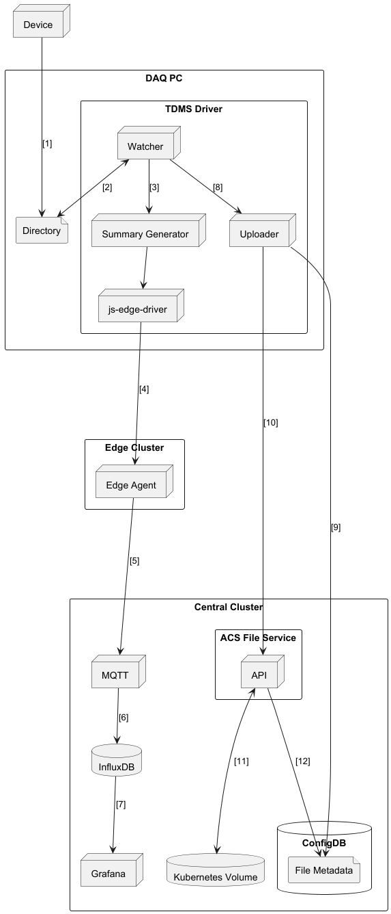

# File Service Octant

## Objective

- Define process for the automatic ingestion of large TDMS files from the local file system directory into
the ACS File Service storage.

- Investigate if ACS can extract a data summary from the TDMS files.

- The application must support the uploading of file being produced at a rate ranging from 1-10+ minutes and sizes ranging from 100MB to 14GB.
The files will contain data from the sensors written at a high frequency (1MHz).

## Solution

### TDMS Driver
A Driver will be created to automatically upload TDMS files from the edge, using the driver "Uploader" component, to the 
ACS File Service using the driver folder "Watcher" component to detect new files and publish a summary of the TDMS file 
over MQTT using the js-edge-driver library.

The driver application will be a NodeJS application which watches a directory for new files, when a file is created in 
this directory, a TDMS file summary will be generated by a Python application started by the NodeJS Driver application, 
once the summary has been generated, the Driver will publish it to the Edge Agent over MQTT. The created file will also be 
uploaded to ACS-Files. The TDMS Driver will run off cluster and use the JS-Service-Client with username and password 
authentication.

### Deployment Diagram 

### File Upload process
1. The TDMS file is created by the data producer and stored in a directory on the local file system.  
2. The Watcher detects a new file has been created and emits an event to event listeners.
3. The Summary Generator runs the python script.
4. The driver publishes the batched metric payload over MQTT to the Edge Agent. 
5. The file summary is published by the Edge Agent to the Central cluster MQTT broker.
6. The file summary is stored in the historian. 
7. The summary is visible in Grafana using the Influx datasource.
8. The Uploader receives an event from the Watcher that a new file has been created.
9. The Uploader creates a file object in configDB.
10. The Uploader set any metadata (file type, device id) in the files config entry.
11. The Uploader sends a `PUT` request to ACS-Files with the created TDMS file.
12. ACS-Files writes the file to a Kubernetes volume.
13. A files config entry is created in configDB for the file metadata. 

