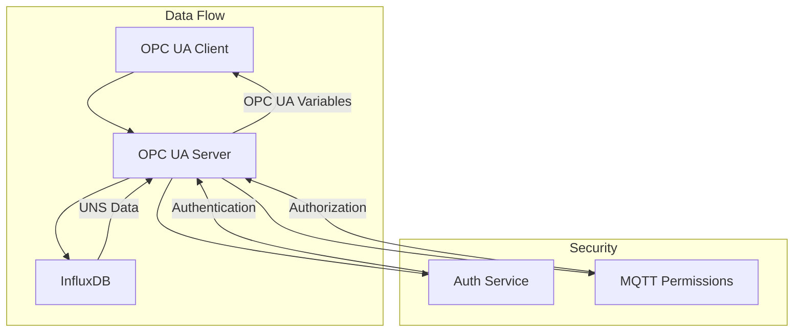

# OPC UA Server

The OPC UA Server component provides standard OPC UA access to data stored in the Factory+ Unified Namespace (UNS). It acts as a bridge between OPC UA clients and the InfluxDB backend where UNS data is stored.

## Overview

The OPC UA Server enables integration with existing OPC UA-based systems and tools by exposing UNS data through the standard OPC UA protocol. This allows:

- SCADA systems to read Factory+ data
- Historians to collect data via OPC UA
- Analytics tools to access real-time and historical data
- Third-party applications to integrate with Factory+

## Architecture



## Data Organization

The OPC UA address space mirrors the UNS structure:

### Hierarchy
```
Root/
└── FactoryPlusUNS/
    └── {Group}/
        └── {Node}/
            └── {Device}/
                └── {Path}/
                    └── {Measurement}
```

### Example
```
Root/
└── FactoryPlusUNS/
    └── Production/
        └── Line1/
            └── Robot1/
                └── Status/
                    ├── Temperature
                    ├── Pressure
                    └── Running
                └── Counters/
                    ├── PartsProduced
                    └── CycleTime
```

## Features

### OPC UA Compliance
- Standard OPC UA server implementation
- Support for multiple security policies
- Variable nodes with current values and timestamps
- Browsable address space

### Authentication
- Integration with Factory+ authentication service
- Support for anonymous and authenticated access
- Username/password authentication
- Future support for certificate-based authentication

### Authorization
- Uses Factory+ MQTT permission system
- Per-path access control
- Respects UNS read permissions

### Data Access
- Real-time current values from InfluxDB
- Timestamped data retrieval
- Automatic data type mapping
- Caching for performance

## Configuration

### Helm Chart Configuration

```yaml
opcuaServer:
  enabled: true
  replicas: 1
  
  # InfluxDB connection
  influx:
    url: "http://acs-influxdb2:8086"
    tokenSecret: "influxdb-auth"
    tokenKey: "admin-token"
    org: "default"
    bucket: "uns"
  
  # Service exposure
  service:
    type: ClusterIP
    # For external access:
    # type: LoadBalancer
    # loadBalancerIP: "192.168.1.100"
  
  # Resource limits
  resources:
    limits:
      memory: "512Mi"
      cpu: "500m"
    requests:
      memory: "256Mi"
      cpu: "250m"
```

### Environment Variables

| Variable | Description | Default |
|----------|-------------|---------|
| `OPCUA_PORT` | OPC UA server port | 4840 |
| `OPCUA_HOSTNAME` | Server hostname | 0.0.0.0 |
| `HTTP_PORT` | HTTP management port | 8080 |
| `INFLUX_URL` | InfluxDB URL | - |
| `INFLUX_TOKEN` | InfluxDB token | - |
| `INFLUX_ORG` | InfluxDB organization | default |
| `INFLUX_BUCKET` | InfluxDB bucket | uns |
| `VERBOSE` | Logging verbosity | - |

## Security

### OPC UA Security
The server supports multiple security configurations:

- **Security Policy**: None, Basic128Rsa15, Basic256, Basic256Sha256
- **Message Security Mode**: None, Sign, SignAndEncrypt
- **User Authentication**: Anonymous, Username/Password

### Factory+ Integration
- Authentication via Factory+ auth service
- Authorization via MQTT permissions
- Service account for InfluxDB access

## Client Connection

### Connection URL
```
opc.tcp://<server-ip>:4840/UA/FactoryPlusUNS
```

### Example Client Code (Node.js)
```javascript
const { OPCUAClient } = require("node-opcua");

const client = OPCUAClient.create({
    endpointMustExist: false
});

const endpointUrl = "opc.tcp://localhost:4840/UA/FactoryPlusUNS";

async function main() {
    await client.connect(endpointUrl);
    const session = await client.createSession();
    
    // Browse the address space
    const browseResult = await session.browse("RootFolder");
    console.log("Root folder children:", browseResult.references);
    
    // Read a variable
    const dataValue = await session.readVariableValue(
        "ns=1;s=FactoryPlusUNS/Production/Line1/Robot1/Status/Temperature"
    );
    console.log("Temperature:", dataValue.value.value);
    
    await session.close();
    await client.disconnect();
}

main().catch(console.error);
```

## Monitoring

### Health Checks
- **Liveness**: `GET /ping`
- **Readiness**: `GET /ping`
- **Status**: `GET /status`

### Metrics
The service exposes operational metrics:
- OPC UA connection count
- Data read operations
- InfluxDB query performance
- Authentication success/failure rates

## Troubleshooting

### Common Issues

#### No Data Available
- Check InfluxDB connection and credentials
- Verify UNS data exists in the configured bucket
- Check service logs for InfluxDB errors

#### Authentication Failures
- Verify Factory+ auth service is running
- Check user credentials and permissions
- Review MQTT permission configuration

#### Connection Refused
- Ensure OPC UA port (4840) is accessible
- Check firewall and network configuration
- Verify service is running and healthy

#### Performance Issues
- Monitor InfluxDB query performance
- Check cache hit rates
- Consider increasing replica count

### Debug Logging
Enable verbose logging:
```yaml
opcuaServer:
  verbose: "ALL"
```

## Integration Examples

### SCADA Systems
Most SCADA systems support OPC UA clients. Configure them to connect to:
- **Server URL**: `opc.tcp://your-server:4840/UA/FactoryPlusUNS`
- **Security**: Configure based on your requirements
- **Authentication**: Use Factory+ credentials

### Historians
Configure historians to collect data via OPC UA:
- Browse the address space to discover variables
- Set up subscriptions for real-time data
- Configure historical data collection

### Analytics Tools
Use OPC UA libraries in your analytics applications:
- Python: `opcua` library
- .NET: OPC Foundation .NET libraries
- Java: Eclipse Milo
- Node.js: `node-opcua`

## Performance Considerations

### Caching
- Current values are cached for 5 seconds by default
- Address space structure is cached for 30 seconds
- Cache timeouts are configurable

### Scaling
- Multiple replicas can be deployed for high availability
- Each replica maintains its own cache
- Load balancing is handled by Kubernetes services

### InfluxDB Optimization
- Use appropriate time ranges for queries
- Consider InfluxDB query optimization
- Monitor query performance and adjust as needed

## Future Enhancements

- Historical data access via OPC UA Historical Access
- Subscription support for real-time notifications
- Certificate-based authentication
- Custom OPC UA methods for Factory+ operations
- Integration with Factory+ command escalation
