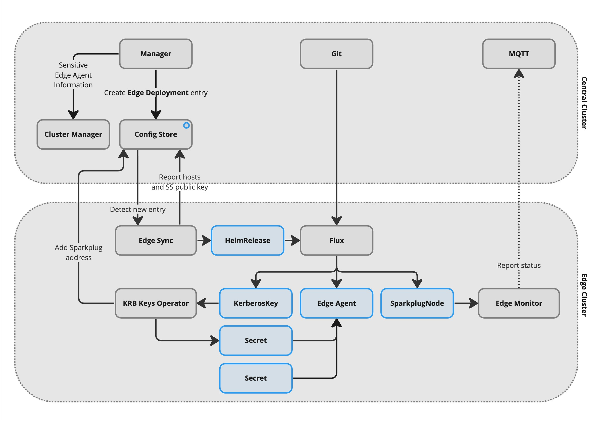

# What's changed in V3?

## Edge clusters

V3 of the AMRC Connectivity Stack introduces a number of new components to enable effective management of edge clusters. Prior to this version, the chart was designed to be installed onto a single central cluster that consisted of all central nodes _and_ all edge nodes. This was not ideal for a number of reasons, including the fact that it was impossible to utilise cloud-based clusters with on-premise edge nodes, in most cases.

Through changes to the Manager in V3, is is now possible to create "Edge Clusters" directly from the Manager UI. This action will provide you with a bootstrap script to run on a fresh Kubernetes cluster at the edge. The bootstrap script handles the installation and configuration of all necessary components to connect the edge cluster to the central cluster.

Once the edge cluster is connected to the central cluster, it will appear in the Manager UI and can have workloads assigned to it. The process for assigning workloads to edge clusters relies on components deployed to the edge during the bootstrap process, which ultimately watch the Config Store for changes to their state.

## Visualiser

The Visualiser (`visualiser.<baseURL>`) is a new component included in ACS V3 that provides a visual representation of Factory+ traffic and MQTT packets. This application is accessible from the Manager UI and provides a real-time overview of the MQTT traffic flowing through the system. It can be useful for debugging and understanding the flow of data through the system but also serves as a great communication tool for demonstrating the capabilities of Factory+.

## Sensitive information management

V3 leverages the power of kubernetes secrets to store sensitive configuration information such as passwords and keys for connecting to equipment. Whereas before sensitive information was stored in the device configuration files for your devices, it is now stored in kubernetes secrets and accessed by the devices at runtime. This is a more secure way of managing sensitive information ensures that only the edge cluster destined to represent the device has access to the information.

